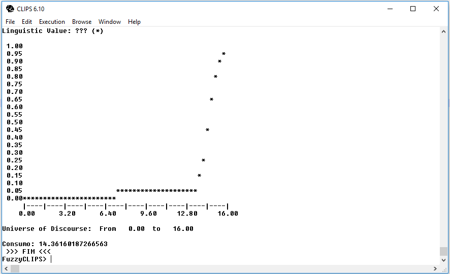
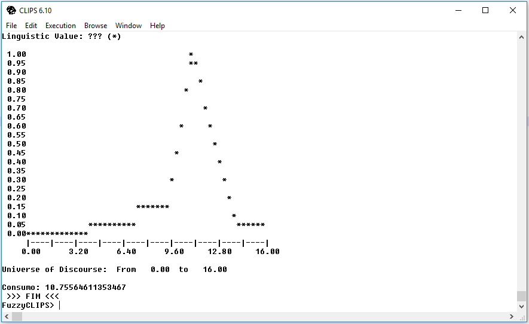
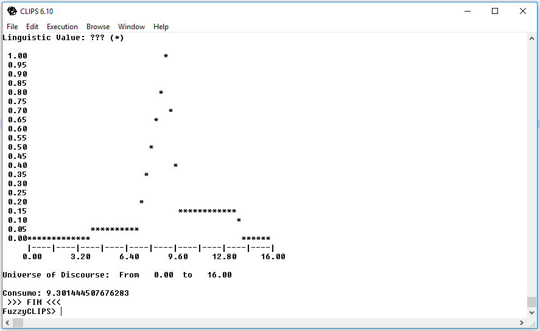

<h3 align="center">Implementação de um Sistema Especialista Fuzzy para Consumo de Combustível</h3>
<h3 align="center">Lucas Chegatti e Arthur Dalcastagne</h3>

### 1 Introdução

<p align="justify">
  Esse relatório descreve toda a implementação do Sistema Especialista Fuzzy para Consumo de Combustível utilizando a ferramenta FuzzyClips. O objetivo do sistema é controlar o consumo de combustível do veículo, considerando como variáveis auxiliares a velocidade e o peso do veículo.
</p>

<p align="center">
  As variáveis linguísticas de entrada e saída são mostradas na tabela 1.
  
  <br/>
  Tabela 1 Variáveis linguísticas para consumo de combustível
</p>

<p align="justify">
A primeira coluna da tabela 1 descreve os valores considerados para o peso do carro, enquanto na primeira linha descreve os valores considerados para a velocidade do veículo, as demais informações são em relação ao consumo de combustível de acordo com o peso e velocidade.
</p>

### 2 Implementações e Testes

<p align="justify">
  Para implementar o código foi utilizado um editor de texto Visual Studio Code, e no código foram descritos um template para cada variável linguística, foi utilizado duas funções pré-definidas (Z e S) e uma trapezoide:
</p>

```
(deftemplate Peso
0 1300 kg
    ((leve (z 0 800))
    (medio (700 0)(800 1)(1000 1)(1100 0))
    (pesado (s 1000 1300))
    )
)
```

<p align="justify">
  O código acima mostra o template criado para definir as variáveis de Peso, onde é considerado:
  <ul>
    <li>Peso leve de 0 a 800 Quilos</li>
    <li>Peso medio entre 700 a 1100 Quilos</li>
    <li>Peso pesado de 1000 a 1300 Quilos</li>
  </ul>
</p>

<p align="justify">
  A Figura 1 mostra os valores numéricos possíveis para o Peso, leva em consideração as variáveis linguísticas na Tabela 1 e no template em questão.
</p>

<p align="center">
  As variáveis linguísticas de entrada e saída são mostradas na Tabela 1.
  
  <br/>
  Figura 1. Plotagem dos Valores numéricos possíveis para a Peso
</p>

```
(deftemplate Velocidade
0 140 km/h
    ((baixa (z 0 60))
    (media (50 0)(60 1)(90 1)(100 0))
    (alta (s 90 140))
    )
)
```

<p align="justify">
  O código acima mostra o template criado para definir as variáveis de Velocidade, onde é considerado:
  <ul>
    <li>Velocidade baixa de 0 a 60 Quilômetros por hora</li>
    <li>Velocidade media entre 50 a 100 Quilômetros por hora</li>
    <li>Velocidade alta de 90 a 140 Quilômetros por hora</li>
  </ul>
</p>
  
<p align="justify">
  A Figura 2 mostra os valores numéricos possíveis para a Velocidade, leva em consideração as variáveis linguísticas na Tabela 1 e no template em questão.
</p>

<p align="center">
  As variáveis linguísticas de entrada e saída são mostradas na Tabela 1.
  
  <br/>
  Figura 2. Plotagem dos Valores numéricos possíveis para a Velocidade
</p>

```
(deftemplate Consumo
0 16 km/l 
    ((muito_baixo (s 13 16))
    (baixo (9 0)(11 1)(14 0))
    (medio (7 0)(9 1)(10 0))
    (alto (4 0)(6 1)(8 0))
    (muito_alto (z 0 5))
    )
)
```

<p align="justify">
  O código acima mostra o template criado para definir as variáveis de Consumo, onde é considerado:
  <ul>
    <li>Consumo muito baixo de 13 a 16 Quilômetros por litro</li>
    <li>Consumo baixo entre 9 a 14 Quilômetros por litro</li>
    <li>Consumo medio entre 7 a 10 Quilômetros por litro</li>
    <li>Consumo alto entre 4 a 8 Quilômetros por litro</li>
    <li>Consumo muito alto de 0 a 5 Quilômetros por litro</li>
  </ul> 
</p>

<p align="justify">
  A Figura 3 mostra os valores numéricos possíveis para a Consumo, leva em consideração as variáveis linguísticas na Tabela 1 e no template em questão.
</p>

<p align="center">
  As variáveis linguísticas de entrada e saída são mostradas na Tabela 1.
  
  <br/>
  Figura 3. Plotagem dos Valores numéricos possíveis para a Consumo
</p>

<p align="justify">
  As regras que definiram o consumo de combustível do veículo foram divididas em 5 regras diferentes, considerando uma para cada variável linguística. A utilização da declaração da salience foi a solução adotada para garantir que essas regras fossem executadas antes da regra final de defuzzificação.
  Abaixo são listadas as 5 regras:
</p>

```
(defrule muito_baixo
    (declare (salience 10))
    (Peso leve)
    (Velocidade baixa)
=>
    (assert (Consumo muito_baixo))
)

(defrule baixo
    (declare (salience 10))
    (or (and (Peso medio) (Velocidade baixa))
        (and (Peso leve) (Velocidade media)) 
    )
=>
    (assert (Consumo baixo))
)

(defrule medio
    (declare (salience 10))
    (or (and (Peso pesado) (Velocidade baixa))
        (and (Peso medio) (Velocidade media)) 
        (and (Peso leve) (Velocidade alta)) 
    )
=>
    (assert (Consumo medio))
)

(defrule alto
    (declare (salience 10))
    (or (and (Peso pesado) (Velocidade media))
        (and (Peso medio) (Velocidade alta)) 
    )
=>
    (assert (Consumo alto))
)

(defrule muito_alto
    (declare (salience 10))
    (Peso pesado)
    (Velocidade alta)
=>
    (assert (Consumo muito_alto))
)
```

<p align="justify">
  Para a defuzzificação, foi criado uma variável global e uma regra onde faz a plotagem do valor numérico encontrado. A regra se chama defuzifica e foi declarada com salience 0 para que fosse executada depois das demais regras do sistema.
</p>

```
(defglobal
    ?*g_resultado* = 0
)

(defrule defuzifica
  (declare (salience 0))
  ?v_tmp <- (Consumo ?)
=>
  (bind ?*g_resultado* (moment-defuzzify ?v_tmp))
  (plot-fuzzy-value t "*" nil nil ?v_tmp)
  (retract ?v_tmp)
  (printout t "Consumo: ")
  (printout t ?*g_resultado* crlf)
  (printout t " >>> FIM <<< " crlf)
)
```

### 3 Resultados Obtidos

<p align="justify">
  Os valores finais foram testados através do deffacts, onde é inserido fatos que são tratados nas regras do sistema. Com o intuito de testar as regras e obter os valores numéricos relacionados ao resultado. O código abaixo mostra a utilização dos valores para Peso e Velocidade.
</p>

```
(deffacts Consumo
  (Peso medio)
  (Velocidade media)
)
```

<p align="center">
  A Figura 4 mostra os resultados obtidos para os valores acima.
  
  <br/>
  Figura 4. Resultado dos valores setados como Peso medio e Velocidade media.</br>
  (Consumo aproximado de 7.73 quilômetros por litro)
</p>

<p align="justify">
As Figuras 5, 6, 7, 8, 9, 10, 11 e 12 logo abaixo mostram os resultados obtidos para as demais possibilidades de valores de Peso e Velocidade considerados na Tabela 1.
</p>

```
(deffacts Consumo
  (Peso leve)
  (Velocidade baixa)
)
```

<p align="center">
  A Figura 5 mostra os resultados obtidos para os valores acima.
  
  <br/>
  Figura 5. Resultado dos valores setados como Peso leve e Velocidade baixa.</br>
  (Consumo aproximado de 14.36 quilômetros por litro)
</p>

```
(deffacts Consumo
  (Peso leve)
  (Velocidade media)
)
```

<p align="center">
  A Figura 6 mostra os resultados obtidos para os valores acima.
  
  <br/>
  Figura 6. Resultado dos valores setados como Peso leve e Velocidade media.</br>
  (Consumo aproximado de 11.12 quilômetros por litro)
</p>

```
(deffacts Consumo
  (Peso leve)
  (Velocidade alta)
)
```

<p align="center">
  A Figura 7 mostra os resultados obtidos para os valores acima.
  
  <br/>
  Figura 7. Resultado dos valores setados como Peso leve e Velocidade alta.</br>
  (Consumo aproximado de 9.03 quilômetros por litro)
</p>

```
(deffacts Consumo
  (Peso medio)
  (Velocidade baixa)
)
```

<p align="center">
  A Figura 8 mostra os resultados obtidos para os valores acima.
  
  <br/>
  Figura 8. Resultado dos valores setados como Peso medio e Velocidade baixa.</br>
  (Consumo aproximado de 10.75 quilômetros por litro)
</p>

```
(deffacts Consumo
  (Peso medio)
  (Velocidade alta)
)
```

<p align="center">
  A Figura 9 mostra os resultados obtidos para os valores acima.
  
  <br/>
  Figura 9. Resultado dos valores setados como Peso medio e Velocidade alta.</br>
  (Consumo aproximado de 5.52 quilômetros por litro)
</p>

```
(deffacts Consumo
  (Peso pesado)
  (Velocidade baixa)
)
```

<p align="center">
  A Figura 10 mostra os resultados obtidos para os valores acima.
  
  <br/>
  Figura 10. Resultado dos valores setados como Peso pesado e Velocidade baixa.</br>
  (Consumo aproximado de 9.30 quilômetros por litro)
</p>

```
(deffacts Consumo
  (Peso pesado)
  (Velocidade media)
)
```

<p align="center">
  A Figura 11 mostra os resultados obtidos para os valores acima.
  
  <br/>
  Figura 11. Resultado dos valores setados como Peso pesado e Velocidade media.</br>
  (Consumo aproximado de 6.36 quilômetros por litro)
</p>

```
(deffacts Consumo
  (Peso pesado)
  (Velocidade alta)
)
```

<p align="center">
  A Figura 12 mostra os resultados obtidos para os valores acima.
  
  <br/>
  Figura 12. Resultado dos valores setados como Peso pesado e Velocidade alta.</br>
  (Consumo aproximado de 2.64 quilômetros por litro)
</p>

### 4 Conclusão

<p align="justify">
Concluimos então com os resultados obtidos que a implementação e os teste ocorreram de maneira correta e esperada. Os Consumos que foram calculados através dos deffrules nos mostram que quanto menos Peso e menos Velocidade o carro tiver, menor sera o Consumo de combustível, assim como quanto maior o Peso e maior a Velocidade, respectivamente será maior o Consumo. Esse sistema especialista pode ser facilmente aplicado para pessoas comuns em busca de melhores resultados sobre consumo de seu veículo, tendo em vista a alta inflação que ocorre na atualidade em relação ao preço do combustível.
</p>
