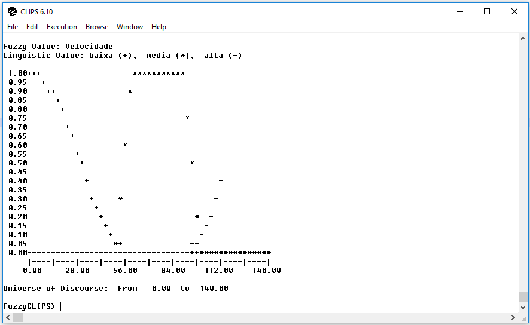
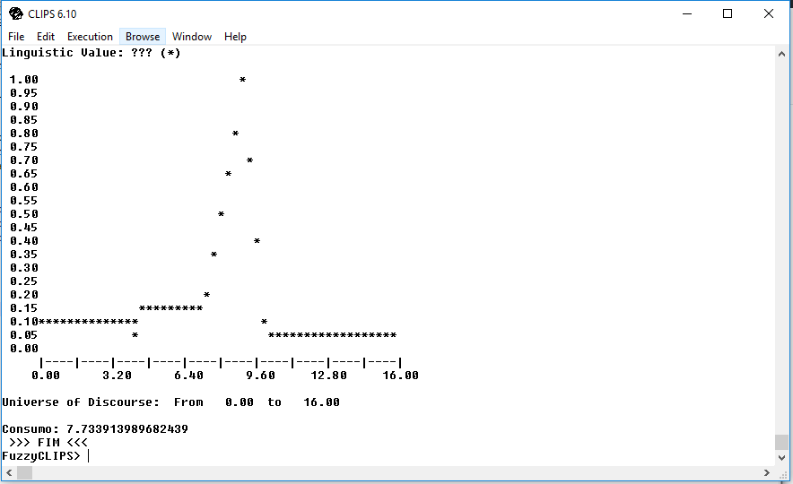

### Implementação de um Sistema Especialista Fuzzy para Consumo de Combustível
### Lucas Chegatti e Arthur Dalcastagne

### 1 Introdução

<p>
  Esse relatório descreve toda a implementação do Sistema Especialista Fuzzy para Consumo de Combustível utilizando a ferramenta FuzzyClips. O objetivo do sistema é controlar o consumo de combustível do veículo, considerando como variáveis auxiliares a velocidade e o peso do veículo.
</p>
<p align="center">
  As variáveis linguísticas de entrada e saída são mostradas na tabela 1.
  
  <br/>
  Tabela 1 Variáveis linguísticas para consumo de combustível
</p>
<p>
A primeira coluna da tabela 1 descreve os valores considerados para o peso do carro, enquanto na primeira linha descreve os valores considerados para a velocidade do veículo, as demais informações são em relação ao consumo de combustível de acordo com o peso e velocidade.
</p>

### 2 Implementações e Testes

<p>
  Para implementar o código foi utilizado um editor de texto Visual Studio Code, e no código foram descritos um template para cada variável linguística, foi utilizado duas funções pré-definidas (Z e S) e uma trapezoide:
</p>

```
(deftemplate Peso
0 1300 kg
    ((leve (z 0 800))
    (medio (700 0)(800 1)(1000 1)(1100 0))
    (pesado (s 1000 1300))
    )
)
```

<p>
  O código acima mostra o template criado para definir as variáveis de Peso. A Figura 1 mostra os valores numéricos possíveis para o Peso, leva em consideração as variáveis linguísticas na Tabela 1 e no template em questão.
</p>

<p align="center">
  As variáveis linguísticas de entrada e saída são mostradas na Tabela 1.
  
  <br/>
  Figura 1. Plotagem dos Valores numéricos possíveis para a Peso
</p>

```
(deftemplate Velocidade
0 140 km/h
    ((baixa (z 0 60))
    (media (50 0)(60 1)(90 1)(100 0))
    (alta (s 90 140))
    )
)
```

<p>
  O código acima mostra o template criado para definir as variáveis de Velocidade. A Figura 2 mostra os valores numéricos possíveis para a Velocidade, leva em consideração as variáveis linguísticas na Tabela 1 e no template em questão.
</p>

<p align="center">
  As variáveis linguísticas de entrada e saída são mostradas na Tabela 1.
  
  <br/>
  Figura 2. Plotagem dos Valores numéricos possíveis para a Velocidade
</p>

```
(deftemplate Consumo
0 16 km/l 
    ((muito_baixo (z 0 5))
    (baixo (4 0)(6 1)(8 0))
    (medio (7 0)(9 1)(10 0))
    (alto (9 0)(11 1)(14 0))
    (muito_alto (s 13 16))
    )
)
```

<p>
  O código acima mostra o template criado para definir as variáveis de Consumo. A Figura 3 mostra os valores numéricos possíveis para a Consumo, leva em consideração as variáveis linguísticas na Tabela 1 e no template em questão.
</p>

<p align="center">
  As variáveis linguísticas de entrada e saída são mostradas na Tabela 1.
  
  <br/>
  Figura 3. Plotagem dos Valores numéricos possíveis para a Consumo
</p>

<p>
  As regras que definiram o consumo de combustível do veículo foram divididas em 5 regras diferentes, considerando uma para cada variável linguística. A utilização da declaração da salience foi a solução adotada para garantir que essas regras fossem executadas antes da regra final de defuzzificação.
  Abaixo são listadas as 5 regras:
</p>

```
(defrule muito_baixo
    (declare (salience 10))
    (Peso leve)
    (Velocidade baixa)
=>
    (assert (Consumo muito_baixo))
)

(defrule baixo
    (declare (salience 10))
    (or (and (Peso medio) (Velocidade baixa))
        (and (Peso leve) (Velocidade media)) 
    )
=>
    (assert (Consumo baixo))
)

(defrule medio
    (declare (salience 10))
    (or (and (Peso pesado) (Velocidade baixa))
        (and (Peso medio) (Velocidade media)) 
        (and (Peso leve) (Velocidade alta)) 
    )
=>
    (assert (Consumo medio))
)

(defrule alto
    (declare (salience 10))
    (or (and (Peso pesado) (Velocidade media))
        (and (Peso medio) (Velocidade alta)) 
    )
=>
    (assert (Consumo alto))
)

(defrule muito_alto
    (declare (salience 10))
    (Peso pesado)
    (Velocidade alta)
=>
    (assert (Consumo muito_alto))
)
```

<p>
  Para a defuzzificação, foi criado uma variável global e uma regra onde faz a plotagem do valor numérico encontrado. A regra se chama defuzifica e foi declarada com salience 0 para que fosse executada depois das demais regras do sistema.
</p>

```
(defglobal
    ?*g_resultado* = 0
)

(defrule defuzifica
  (declare (salience 0))
  ?v_tmp <- (Consumo ?)
=>
  (bind ?*g_resultado* (moment-defuzzify ?v_tmp))
  (plot-fuzzy-value t "*" nil nil ?v_tmp)
  (retract ?v_tmp)
  (printout t "Consumo: ")
  (printout t ?*g_resultado* crlf)
  (printout t " >>> FIM <<< " crlf)
)
```

<p>
  Os valores finais foram testados através do deffacts, onde é inserido fatos que são tratados nas regras do sistema. Com o intuito de testar as regras e obter os valores numéricos relacionados ao resultado. O código abaixo mostra a utilização dos valores para Peso e Velocidade.
</p>

```
(deffacts Consumo
  (Peso medio)
  (Velocidade media)
)
```

<p align="center">
  A Figura 4 mostra os resultados obtidos para os valores acima.
  
  <br/>
  Figura 4. Resultado dos valores setados como Peso medio e Velocidade media
</p>
